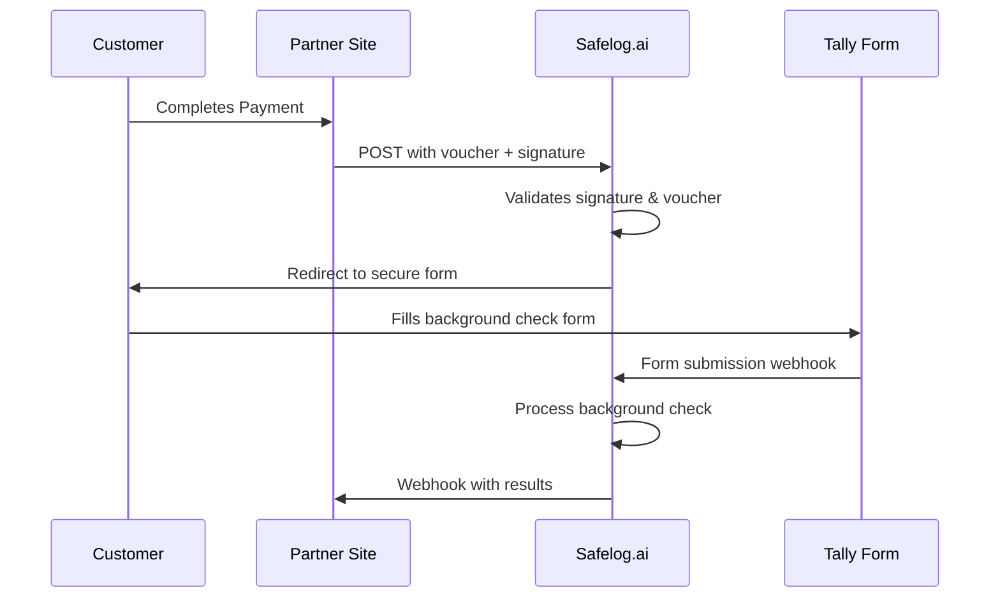

# Integration
{: .fs-8 }

Complete guides for integrating Safelog.ai background check services into your platform
{: .fs-6 .fw-300 }

---

## 📋 Available Integration Guides

{: .highlight }
Choose the integration method that best fits your technical requirements and workflow

### [Partner Integration Guide](partner-integration/)
Complete step-by-step implementation guide for integrating background check forms into your website with webhook-based payment flow.

**Features:**
- Post-payment redirect integration
- HMAC signature validation
- JWT-based secure sessions
- Rate limiting and security controls

### [Webhook Specification](webhook-spec/)
Detailed documentation for receiving background check results and report file delivery notifications.

**Includes:**
- Webhook payload structure
- Signature verification examples
- Error handling and retry policies
- Code samples in multiple languages

---

## 🚀 Quick Integration Steps

{: .important }
> **Prerequisites:** Contact Safelog.ai to obtain your partner credentials before starting

1. **Get API Credentials**
   - Partner ID
   - HMAC Secret Key
   - Webhook endpoint URL

2. **Implement Payment Flow**
   - Follow the [Partner Integration Guide](partner-integration/)
   - Set up post-payment redirects to Safelog.ai

3. **Configure Webhooks**
   - Implement webhook endpoint using [Webhook Specification](webhook-spec/)
   - Set up signature verification

4. **Test Integration**
   - Use sandbox environment
   - Verify webhook delivery
   - Test complete flow end-to-end

---

## 🔒 Security Features

All integration methods include enterprise-grade security:

**Authentication & Authorization**
- HMAC-SHA256 signature validation
- JWT-based session management
- Partner-specific API credentials

**Protection & Rate Limiting**  
- DDoS protection and rate limiting
- Secure form proxying
- Input validation and sanitization

**Monitoring & Compliance**
- Comprehensive audit logging
- Request/response tracking
- Compliance with data protection standards

---

## 🏗️ Architecture Overview

---

## 💬 Support & Resources

**Technical Support**
- Email: [support@safelog.ai](mailto:support@safelog.ai)
- Response time: Within 24 hours

**Documentation**  
- API Reference: This documentation
- Status Page: [status.safelog.ai](https://status.safelog.ai)
- GitHub Issues: Report bugs and feature requests

**Testing Environment**
- Sandbox credentials available on request
- Test webhook delivery tools
- Integration validation checklist